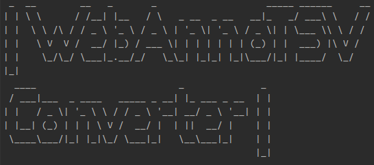
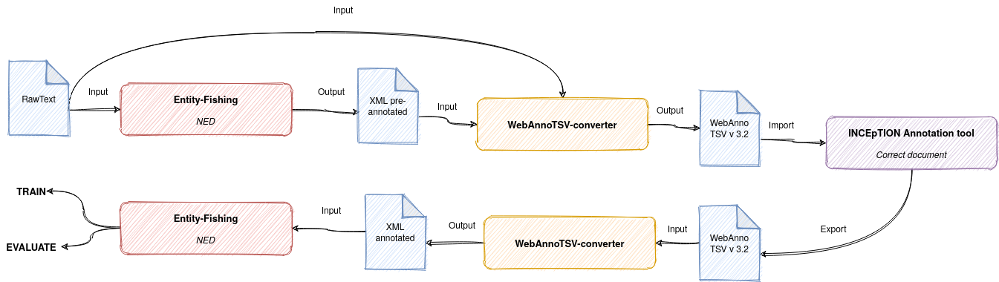

# WebAnnoTSV-converter




## Description

CLI prototype to read, write and transform WebAnno tsv 3.2 format files export from INCEpTION platform for NER & NED with Entity-fishing.

## Motivation & Workflow

Corrected XML files for long datasets to create golden corpus with named entity recognition and disambiguation tool [Entity-Fishing](https://nerd.readthedocs.io/en/latest/) may be difficult because it has to be corrected directly in native XML
with [guidelines](https://nerd.readthedocs.io/en/latest/annotationsGuidelines.html).

[INCEpTION](https://inception-project.github.io/) is a graphical platform offering a set of tools for manage NER & NED projects and annotating, linking, and / or correcting annotations raw texts or other formats.

The bridge between Entity-fishing and INCEpTION is however difficult. The WebAnno TSV format exported from INCEpTION to find all the annotated 
information is not directly compatible with Entity-Fishing.

WebAnnoTSV-Converter attempts to create a link between the INCEpTION annotation tool and Entity-Fishing for named entity recognition and disambiguation tool.

### ~ Uses Cases (timeline schema) ~

### 1) Create a new corpus with INCEpTION **from zero** for Entity-Fishing


### 2) Create a new corpus with INCEpTION from **pre-annotated XML for correction** for Entity-Fishing (not implemented yet)



## Installation & Usage

- Use `Python 3.8+` and install dependencies via `requirements.txt` in a virtual environment;
- Basic usage :

```
python main.py [OPTIONS] FILE OUTPUT
```

- Arguments :
    - `FILE` : absolute or relative path of WebAnno tsv 3.2;
    - `OUTPUT` : csv or xml 
    
for options `python main.py --help`

-Command example : 

```
python main.py -v true -l fr datatest/test.tsv xml
```

Once the process is complete, the xml or csv file is available in the `out/` directory

## Main stack

- [Click](https://click.palletsprojects.com/en/7.x/) : Python package to creating command line interface;
- Fork from [web_anno_tsv](https://github.com/Pangeamt/web_anno_tsv) : Python package to read and write read and write webanno tsv 3.2 files;
- [entity-fishing-client-python](https://github.com/Hirmeos/entity-fishing-client-python) : Python client to query the Entity Fishing service API,
  used to find wikipedia page id.

## Enhancement

Feel free to create an issue to contribute, reveal a bug, or suggest an improvement.

The next priority improvements are:

- Convert Entity-fishing pre-annotated XML files to WebAnno TSV 3.2 files to import them into Inception tool;
- Possibility to export from CONLL 2003 (already possible from the Inception tool);

## License & Contact

Distributed under MIT license. The dependencies used in the project are either themselves distributed under a compatible license.

Main author and contact: Lucas Terriel <lucas.terriel@inria.fr>
